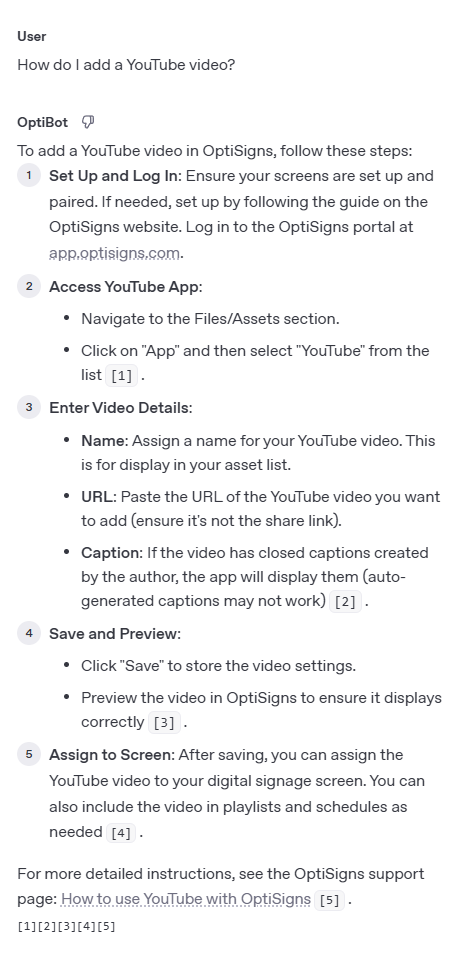

OptiBot Mini-Clone
==================

This project is a streamlined clone of the OptiSigns support bot. It scrapes articles from the OptiSigns Zendesk help center, converts them into Markdown with embedded metadata, uploads them to OpenAI's vector store via API, and runs as a daily job to keep the knowledge base up to date.

Setup
-----

### 1. Clone the Repository

```
git clone https://github.com/aaron-gingrich/OptiBot
cd OptiBot
```

### 2. Install Dependencies

```
pip install -r requirements.txt
```

### 3. Configure Environment Variables

Create a `.env` file:

```
cp .env.sample .env
```

Get your OpenAI API key:
1. Go to https://platform.openai.com/playground/
2. Sign up for a free account if you don't have one
3. Click the gear icon (⚙️) in the top right corner
4. Under "Organization", click on "API keys"
5. Click "Create new secret key" to generate your API key

Update `.env` with your OpenAI API key:

```
OPENAI_API_KEY=your-api-key-here
```

How It Works
------------

### Scraper (`scrape_to_markdown.py`)

- Uses Zendesk's public API to retrieve up to 400 support articles.
- Converts the HTML body of each article to Markdown using `markdownify`.
- Strips out navigation, breadcrumbs, and footers.
- Adds YAML frontmatter metadata including:
  - `title`, `html_url`, `created_at`, `updated_at`, and `label_names`
- Saves each article to the `data/` directory as both `.md` and `.json` files.

### Uploader (`upload_to_openai.py`)

- Reads each Markdown file and calculates a SHA-256 hash.
- Loads `upload_log.json` to detect which files have changed since the last run.
- Uploads only new or updated files using the OpenAI `/files` API.
- Automatically deletes older versions of updated files from OpenAI.
- Attaches the uploaded files to a named vector store.
- Tracks counts of added, updated, and skipped files.
- Saves a run log under `logs/` with timestamped filenames.

### Logging and Summary

After each run, a summary is printed to the console and written to disk:

```
Added:    3
Updated:  2
Skipped: 25
Log file: logs/run_log_YYYYMMDD_HHMMSS.json
```

Docker Usage
------------

This project is Docker-ready and can be scheduled as a recurring job.

### Build the Image

```
docker build -t optibot .
```

### Run the Job

```
docker run --rm `
  -v "$(Get-Location)\data:/app/data" `
  -v "$(Get-Location)\logs:/app/logs" `
  --env-file .env `
  optibot
```

Deployment as Daily Job
------------------------

You can deploy OptiBot as a scheduled job using a **DigitalOcean Droplet** to run daily.

###  Step 1: Create a DigitalOcean Account

1. Go to https://www.digitalocean.com
2. Sign up and verify your email
3. Add a billing method

###  Step 2: Create a Droplet

1. Click **"Create" → "Droplet"**
2. Select **Ubuntu 22.04 (x64)** as the OS
3. Choose a **Basic shared CPU** plan (512MB or 1GB RAM is sufficient)
4. Choose a region (closer to you is better)
5. Enable SSH or set a root password
6. Click **"Create Droplet"**

Once created, copy the droplet’s IP address and SSH into it:

```
ssh root@your_droplet_ip
```

###  Step 3: Install Docker

Run the following inside your droplet:

```
apt update && apt upgrade -y
apt install -y docker.io git
systemctl enable docker
systemctl start docker
```

Verify Docker is installed:

```
docker --version
```

###  Step 4: Clone the Repository

Inside the droplet:

```
git clone https://github.com/aaron-gingrich/OptiBot.git
cd OptiBot
```

###  Step 5: Configure Environment Variables

Create your `.env` file:

```
cp .env.sample .env
nano .env
```

Paste your OpenAI API key and save.

###  Step 6: Build the Docker Image

```
docker build -t optibot .
```

###  Step 7: Run the Bot Manually

```
mkdir -p ./data ./logs

docker run --rm   -v "$(pwd)/data:/app/data"   -v "$(pwd)/logs:/app/logs"   --env-file .env   optibot
```

###  Step 8: Schedule Daily Cron Job

Edit the crontab:

```
crontab -e
```

Add the following line to run the job every day at 8:00 AM server time:

```
0 8 * * * cd /root/OptiBot && git pull origin main && docker build -t optibot . && mkdir -p ./data ./logs && docker run --rm -v /root/OptiBot/data:/app/data -v /root/OptiBot/logs:/app/logs --env-file /root/OptiBot/.env optibot >> /root/OptiBot/logs/cron.log 2>&1
```

Save and exit. The job will now run daily.

Assistant Usage
---------------

After uploading content, the assistant can answer support questions using the uploaded articles. Example prompt:

```
How do I add a YouTube video?
```



Chunking Strategy
-----------------

We are using OpenAI's **automatic chunking strategy** when uploading files to the vector store. Each Markdown article is uploaded as a full document using the `/files` and `/vector-stores` API endpoints, and OpenAI automatically splits the content into optimal embeddings.

This approach was tested in the OpenAI Playground with the assistant attached, and the responses returned accurate answers with correct `Article URL:` citations, confirming the chunking was handled effectively by OpenAI.

Suggestions to Improve OptiBot
------------------------------

- Add thinking/typing indicator
- Enable multilingual support for customers in non-English-speaking regions.


How I Would Improve This Project
--------------------------------

If I had more time, I would:
- Create a script that you run and it does all the installations
- Take into account if article name changes but content does not. Currently this will just create a new file
- Create web app to interact with bot
- Email log report to admin/slack/teams
- Add more error checking to ensure files are added correctly


Project Structure
-----------------

```
.
├── data/                   # Markdown + JSON output
├── logs/                   # Job run logs
├── scrape_to_markdown.py   # Scraping script
├── upload_to_openai.py     # Upload and vector store management
├── Dockerfile              # For job containerization
├── .env.sample             # Environment variable template
├── README.md
```

Requirements
------------

- Python 3.8+
- OpenAI API key
- Internet access for fetching Zendesk articles and uploading to OpenAI


